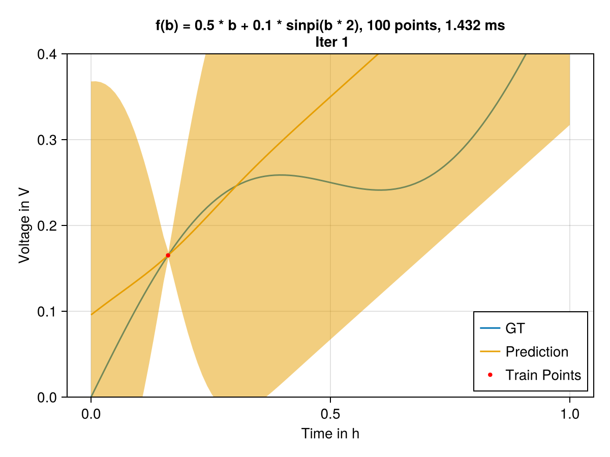

# PAPER NAME
Accompanying code to the paper.......

# Recursive Gaussian Procceses/Usage
The package implements (cite) and allows the instantiation of Kalman Filter (KF) objects from LowLevelParticleFilters.jl through the definition of Recursive Gaussian Processes (RGPs) and named tuples with an initial mean $\mu0$ and covariance matrix $\Sigma$. 
Hyp-paramterer tuning can be done by using OptimizationOptimJL package.
For more information see examples/ folder.

# Setup

# Example
We will use RecursiveGPs package for aproximating a function f(b) = 0.5 * b + 0.1 * sinpi(b * 2), first 100 samples are drawn from a , and then a noise $\sigma = 5e-3$ is added. The RGP is set up with an mean zero and an SEKernel with parameter $\sigma = 0.02, l = 0.1$. In the figures we show the training time, allocations and real time animation of the fitting.

